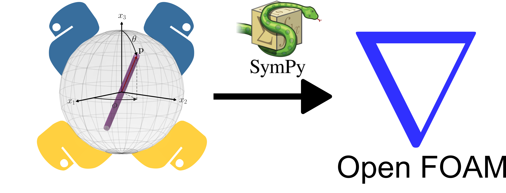

----

The pyhton codes available in this folder compute the contraction between $D_{kl} A_{ijkl}$ and generates C-code to copy/paste into C++ functions.

----
Files:
* *fiberOrientationModelling_symbolicComputationTools.py* &rarr; Python codes with utilities for generating C-code and index permutation 
  
* *hybridClosure.py* &rarr; Python script with hybrid closure
* *IBOFClosure.py* &rarr; Python script with IBOF closure
* *OREClosure.py* &rarr; Python script with ORE closure
* *rsc.py* &rarr; Python script with RSC approach
* *RSC_hybridClosure.py* &rarr; Python script with hybrid closure for RSC
* *RSC_IBOFclosure.py* &rarr; Python script with IBOF closure for RSC
* *RSC_OREClosure.py* &rarr; Python script with ORE closure for RSC
  
----
Required Python Packages that should be installed before running:
*   Sympy: '1.12'
*   re: '2.2.1'
*   itertools

The authors welcome suggestions to enrich this repository. 